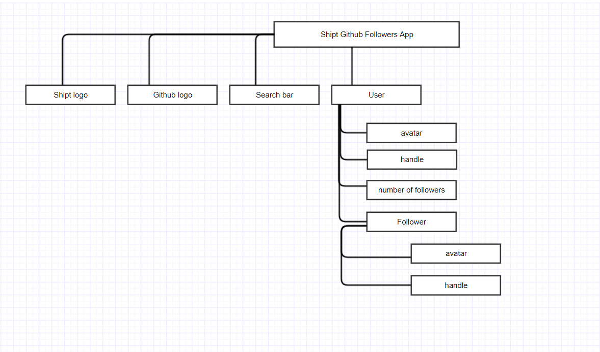

# Github Followers App #


[Demo](https://chandrikabolla.github.io/githubFollowers/)
## Here is how to run ##
---
```
git clone https://github.com/chandrikabolla/chandrikabolla.github.io.git
cd chandrikabolla.github.io/githubFollowers
start index.html
```
### Preface ###
---
I might have chosen react/node for this project. But I sticked to jQuery,AJAX because I have more experience in the later than the former. And I wanted to concentrate much on UI and UX.
### Problem ###
---
Create a service that allows a user to search for a github user and his followers.
### Solution ###
---
A Single Page Application(SPA) that allows user to search for username and display the followers (30 at a time) and provide a loadMore button to display next 30 results on the same page, can be a solution.
### Technical Choices ###
---
I chose jQuery,AJAX for the asynchronous requests to display user and followers. 
Front end- HTML, CSS, Bootstrap
JavaScript - jQuery, AJAX (consumption of github api services)
## Building Process ##
---

### Organizing Requirements ###
---

### Prioritizing Requirements ###
---
* add shipt logo
* add github logo
* search bar
* user - avatar, handle, number of followers
* followers - avatar with ```loadMore``` button
* Datalist - for user search
* followers - handle,repos
* search for a follower in the followers
### Design/ UX
---
Moqups pages:
* [landing page](https://app.moqups.com/chandrika_bolla/4QJDox0Jis/view/page/ab00408de?ui=0)
* [user search page](https://app.moqups.com/chandrika_bolla/4QJDox0Jis/view/page/a18658d61?ui=0)
* [followers page](https://app.moqups.com/chandrika_bolla/4QJDox0Jis/view/page/aa9df7b72?ui=0)
### Error Handling ###
---
Handled errors for search bar user input 
```
username may only contain alphanumeric characters or single hyphens, and cannot begin or end with a hyphen
~ Github 
```
### Left out/ Might have done differently if I were to spend additional time on the project ###
---
I might have added tooltips for information messages for search box instead of text element and might have added some more information about user and followers.
### Author ###
---
[Chandrika Bolla](https://www.linkedin.com/in/chandrika-bolla999/)
- [my other projects](https://github.com/chandrikabolla)
- [my resume](https://drive.google.com/file/d/0ByraOD5PHd9GLVVtRnBfR0hGcG8/view?usp=sharing)
- [link to the hosted application] (https://chandrikabolla.github.io/githubFollowers/)
